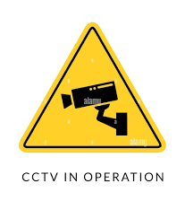
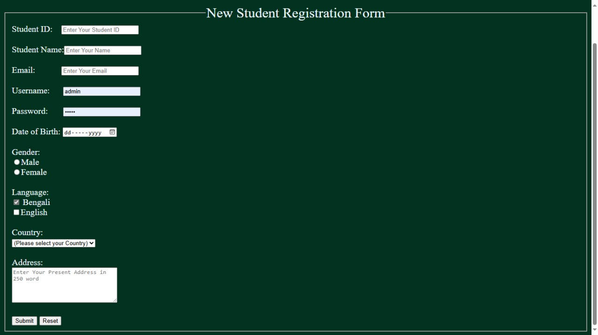
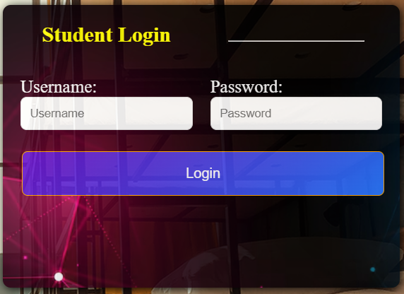
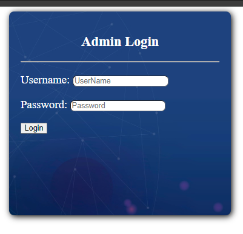
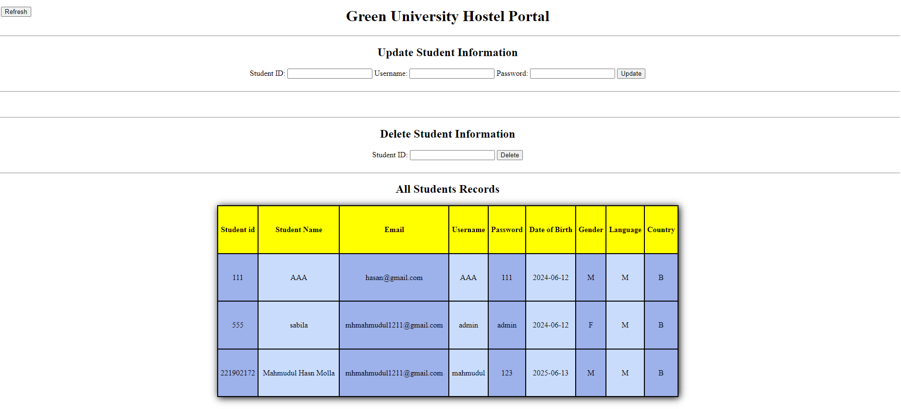
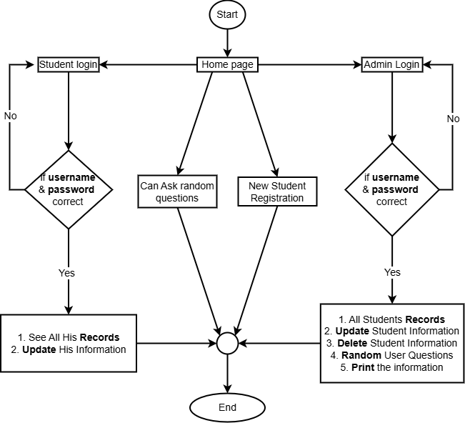

<!DOCTYPE html>
<html lang="en">
<head>
  <meta charset="UTF-8">  
</head>
<body>

  <h1>🏠 GUB Hostel Management System</h1>

  

    <h2>📌 Overview</h2>
    
This is a lab project developed for the Web Programming Lab at Green University of Bangladesh. The system is designed to manage hostel-related activities such as student registration, login, and administrative access using raw HTML, CSS, JavaScript, and PHP.

  

  

    <h2>✨ Features</h2>
    <ul>
      <li>Student registration and login</li>
      <li>Admin login and dashboard</li>
      <li>Database creation and interaction</li>
      <li>Responsive design using custom CSS</li>
      <li>Basic form validation with JavaScript</li>
    </ul>
  

  

    <h2>🛠️ Technology Stack</h2>
    <ul>
      <li><strong>Frontend:</strong> HTML, CSS, JavaScript</li>
      <li><strong>Backend:</strong> PHP</li>
      <li><strong>Database:</strong> MySQL (via PHP scripts)</li>
    </ul>
  

  

    <h2>🖼️ Screenshots</h2>
    
Here are some sample screenshots from the project:

    <h4>Home page:</h4>
    
    <!-- 
     -->
    <h4>Registration form:</h4>
    
    <h4>Student Login page:</h4>
    
    <h4>Admin Login page:</h4>
    
    <h4>After loging the admin can see student's information and update</h4>
    
  

  

    <h2>📂 Project Structure</h2>
    <ul>
      <li><code>Registration.html</code> – Student registration form</li>
      <li><code>login.php</code> – Student login handler</li>
      <li><code>user_login.php</code> – User login logic</li>
      <li><code>adminlogin.css</code> – Admin login styling</li>
      <li><code>createDb.php</code> – Script to create database</li>
      <li><code>JAVA.js</code>, <code>Script.js</code> – JavaScript files for interactivity</li>
    </ul>    
    <h4>Project Flowchart: </h4>
    
  

  

    <h2>🚀 Getting Started</h2>
    <ol>
      <li>Clone the repository: <code>git clone https://github.com/israil-fakir/gub_hostal_management.git</code></li>
      <li>Set up a local server (e.g., XAMPP or WAMP)</li>
      <li>Place the project folder in the <code>htdocs</code> directory</li>
      <li>Run <code>createDb.php</code> to initialize the database</li>
      <li>Access the system via <code>localhost/gub_hostal_management</code></li>
    </ol>
  

  

    <h2>📈 Future Improvements</h2>
    <ul>
      <li>Implement user roles and permissions</li>
      <li>Add hostel room allocation features</li>
      <li>Integrate email notifications</li>
      <li>Improve UI with modern frameworks</li>
    </ul>
  

  

    <h2>👨‍💻 Author</h2>
    
<strong>Md. Israil Fakir</strong> 
    Web Programming Lab Project 
    <a href="https://github.com/israil-fakir">GitHub Profile</a>

  

  

    <h2>📄 License</h2>
    
This project is for educational purposes and does not currently include a license. Feel free to use and modify it for learning and experimentation.

  

</body>
</html>
